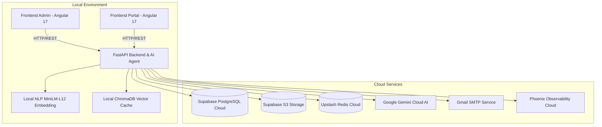

# Architecture Document

## System Overview

[Tóm tắt 2-3 câu về kiến trúc hệ thống]

## Architecture Diagram

## Components

### 1. Frontend (Angular 17 + Ng-Zorro Antd)
- **Admin App (Port 4200):** Dành cho HR/Recruiter quản lý jobs, CVs, ứng viên, phòng phỏng vấn trực tiếp/online, bóc băng và chấm điểm AI.
- **Portal App (Port 4300):** Dành cho ứng viên tìm việc, nộp hồ sơ, upload CV.

### 2. Backend & AI Agent (FastAPI / Python 3.11+)
- **RESTful API:** Quản lý authentication (JWT), jobs, applications, screening pipeline, interview sessions.
- **AI Agent Engine:** Bóc băng âm thanh (STT), phân tích CV/JD, sinh câu hỏi phỏng vấn, đánh giá câu trả lời và chấm điểm tự động.

### 3. Data & Storage Layer (100% Cloud)
- **Database:** Supabase PostgreSQL Cloud (kết nối qua connection pooler).
- **Storage:** Supabase Storage (S3-compatible) lưu file CV (.pdf, .docx) và file audio ghi âm phỏng vấn (.webm, .mp3).
- **Cache:** Upstash Redis Cloud phục vụ caching và rate limiting.
- **Vector & NLP:** Local SentenceTransformers (`paraphrase-multilingual-MiniLM-L12-v2`) + ChromaDB.

## Security
- Toàn bộ secret và connection strings lưu trong `.env` (không commit lên Git).
- Input validation chặt chẽ với Pydantic v2.
- JWT HttpOnly cookies CSRF/XSS protection.

## Design Decisions

| Decision | Choice | Reason |
|----------|--------|--------|
| Framework | FastAPI | Async, auto Swagger docs, type-safe |
| Database | Supabase PostgreSQL Cloud | Cloud-managed, high availability, pooled connection |
| Storage | Supabase S3 Storage | Cloud storage an toàn cho file CV và audio |
| Cache | Upstash Redis Cloud | Serverless Redis cloud nhanh và tin cậy |
| AI / STT | Google Gemini Flash | Đa phương tiện mạnh mẽ, bóc băng tiếng Việt chính xác, chi phí tối ưu |
| Frontend | Angular 17 + Ng-Zorro | Enterprise-grade UI component system |
