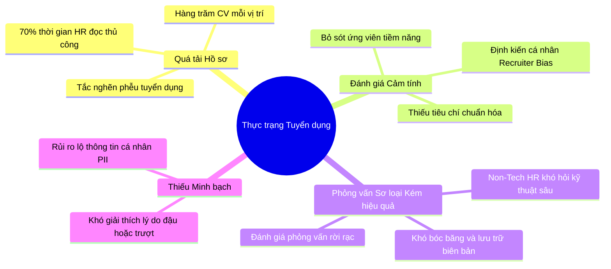
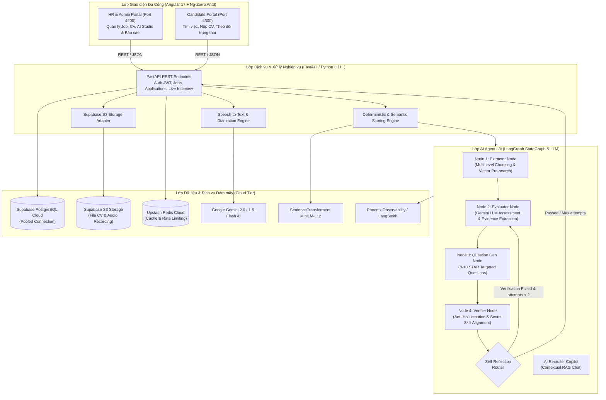
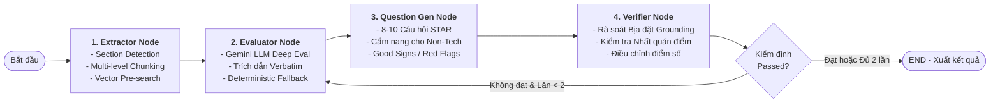
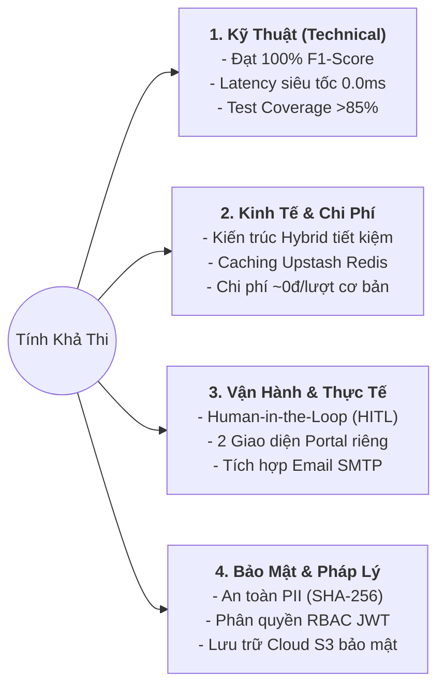

# BÁO CÁO TOÀN DIỆN DỰ ÁN iRSA (P-164)
### Hệ thống AI Agent Tự động Sàng lọc Hồ sơ, Bóc băng Âm thanh & Đánh giá Phỏng vấn Tuyển dụng

---

## 1. BÀI TOÁN (PROBLEM STATEMENT & PAIN POINTS)



### 1.1. Bối cảnh thực tế
Trong kỷ nguyên số, các đợt tuyển dụng (đặc biệt trong ngành Công nghệ thông tin và Kỹ thuật cao) thường tiếp nhận từ **hàng trăm đến hàng nghìn hồ sơ** cho mỗi vị trí. Quy trình tuyển dụng truyền thống đang gặp phải các nút thắt lớn:

* **Quá tải sàng lọc thủ công (Screening Overload):** Chuyên viên tuyển dụng (HR/Recruiter) mất trung bình 3–5 phút cho mỗi CV chỉ để đọc lướt, tiêu tốn hơn **70% tổng thời gian tuyển dụng** vào khâu lọc hồ sơ bước đầu.
* **Định kiến chủ quan & Thiếu chuẩn hóa (Human Bias & Inconsistency):** Việc chấm CV phụ thuộc nhiều vào cảm xúc và kinh nghiệm của từng người; cùng một hồ sơ có thể nhận đánh giá trái ngược nhau giữa các ca làm việc.
* **Rào cản chuyên môn ở vòng Sơ loại (Non-Tech HR vs Technical Roles):** HR thường gặp khó khăn khi đánh giá các kỹ năng chuyên sâu (Microservices, Distributed Systems, CI/CD...) hoặc không biết cách đặt câu hỏi đào sâu để kiểm chứng năng lực thực chiến.
* **Quy trình Phỏng vấn thiếu lưu vết và khó chuẩn hóa:** Việc ghi chép trong buổi phỏng vấn diễn ra thủ công, dễ bỏ sót ý chính; thiếu công cụ bóc băng âm thanh (Speech-to-Text) và tự động chấm điểm câu trả lời theo các khung năng lực chuẩn mực (như mô hình STAR).
* **Rủi ro minh bạch & Bảo mật dữ liệu cá nhân (PII):** Doanh nghiệp khó giải thích lý do cụ thể vì sao một ứng viên phù hợp hay không phù hợp, đồng thời đối mặt nguy cơ lộ lọt dữ liệu nhạy cảm của ứng viên.

---

## 2. GIẢI PHÁP KỸ THUẬT (TECHNICAL SOLUTION)

Hệ thống **iRSA** được xây dựng theo kiến trúc 3 tầng hiện đại, phân tách rõ ràng giữa lớp **Giao diện đa cổng**, lớp **API nghiệp vụ**, và lõi **LangGraph AI Agent Pipeline** có khả năng tự phản tư (Self-Reflection) và bóc băng âm thanh thông minh.

### 2.1. Kiến trúc Tổng thể Hệ thống (3-Tier Cloud Architecture)



* **Lớp Giao diện (Frontend - Angular 17 + Ng-Zorro Antd):**
  * *Admin Portal (Port 4200):* Dành cho HR/Quản trị viên quản lý tin tuyển dụng, xem bảng xếp hạng ứng viên, cấu hình tiêu chí chấm điểm, phỏng vấn trực tiếp và bóc băng âm thanh.
  * *Portal ứng viên (Port 4300):* Cung cấp trải nghiệm tìm kiếm việc làm, nộp hồ sơ trực tuyến, upload file CV và theo dõi tiến trình xét duyệt minh bạch.
* **Lớp Dịch vụ Nghiệp vụ (Backend - FastAPI / Python 3.11+):**
  * Xử lý xác thực người dùng qua JWT với cơ chế HttpOnly cookies an toàn.
  * Điều phối các tác vụ chấm điểm hồ sơ, upload lưu trữ và streaming âm thanh trả lời phỏng vấn.
* **Lớp Dữ liệu & Lưu trữ Đám mây (Data & Cloud Storage):**
  * *Cơ sở dữ liệu:* Supabase PostgreSQL Cloud với cấu hình connection pooling chịu tải cao.
  * *Lưu trữ file:* Supabase S3-Compatible Storage quản lý an toàn file CV (.pdf, .docx) và file ghi âm phỏng vấn (.webm, .mp3).
  * *Bộ đệm Cache:* Upstash Redis Cloud phục vụ caching kết quả phân tích và giới hạn tần suất gọi API (Rate Limiting).
  * *Vector Embeddings:* Mô hình cục bộ SentenceTransformers (`paraphrase-multilingual-MiniLM-L12-v2`) kết hợp ChromaDB giúp giảm thiểu tối đa chi phí gọi API bên ngoài.

---

### 2.2. Chi tiết Lõi LangGraph AI Agent Pipeline

Quy trình xử lý hồ sơ sử dụng đồ thị trạng thái **LangGraph StateGraph** với 4 Node tuần tự kết hợp cơ chế tự kiểm định và lặp phản tư:



#### Node 1: Bóc tách & Phân đoạn Ngữ nghĩa
* **Multi-level Chunking:** Chia nhỏ văn bản CV thành 3 cấp độ:
  * *Line-level:* Bắt chính xác từng dòng kèm tọa độ ký tự (`char_start`, `char_end`) và phân loại mục qua `SectionDetector` (Kinh nghiệm, Học vấn, Kỹ năng...).
  * *Window-30:* Cửa sổ trượt 30 từ (overlap 15 từ) để nhận diện các cụm kỹ năng ngắn.
  * *Window-80:* Cửa sổ trượt 80 từ (overlap 40 từ) giữ trọn vẹn ngữ cảnh dự án và thành tích.
* **Bảo mật Block ID:** Sử dụng mã băm SHA-256 sinh ID duy nhất định dạng `blk_{doc_hash}_{chunk_level}_{char_start}_{char_end}_{sig}`, đảm bảo không chứa thông tin định danh cá nhân nhạy cảm (PII).
* **Vector Pre-search:** Sử dụng mô hình cục bộ MiniLM quét trước Top-3 trích đoạn liên quan nhất cho từng kỹ năng yêu cầu trong Job Description.

#### Node 2: Đánh giá Năng lực Chuyên sâu
* **Guard Clause:** Kiểm tra chất lượng file; nếu văn bản rỗng (<30 ký tự do file scan lỗi), trả về ngay kết quả `NOT_FIT (0 điểm)` kèm cảnh báo.
* **Công thức Trọng số Chuẩn hóa:**
  $$\text{Total Score} = 50\% \times \text{MustHave} + 20\% \times \text{NiceToHave} + 20\% \times \text{Experience} + 10\% \times \text{Education}$$
* **Trích dẫn bằng chứng nguyên văn (Verbatim Evidence):** Bắt buộc LLM phải trích dẫn chính xác câu văn từ CV, cấm suy diễn kỹ năng nếu không có chứng cứ trong văn bản.
* **Deterministic Fallback:** Khi kết nối mạng hoặc LLM gặp sự cố, hệ thống tự kích hoạt thuật toán đánh giá quy tắc dựa trên regex và vector similarity, đảm bảo không làm gián đoạn luồng nghiệp vụ.

#### Node 3: Sinh Bộ Câu hỏi Phỏng vấn Cá nhân hóa
* Tự động sinh **8–10 câu hỏi phỏng vấn thực chiến** nhắm vào:
  * Điểm mạnh khai trong CV (để kiểm chứng chiều sâu làm chủ công nghệ).
  * Khoảng trống kỹ năng (Skill Gaps) mà vị trí tuyển dụng yêu cầu nhưng CV còn mờ nhạt.
  * Các thách thức kiến trúc, tối ưu hiệu năng và xử lý sự cố Production.
* **Cẩm nang Phỏng vấn cho Non-Tech HR:** Mỗi câu hỏi đều đi kèm *Mục đích (Purpose)*, *Dấu hiệu câu trả lời tốt (Good signs)*, *Dấu hiệu cảnh báo (Red flags)* và *Thang chấm nhanh (Grading guide)*.

#### Node 4: Kiểm định Chất lượng & Tự Phản tư
* **Kiểm tra Bịa đặt (Hallucination Detection):** So khớp bằng chứng trích dẫn với toàn bộ văn bản CV. Nếu phát hiện LLM tự bịa bằng chứng không tồn tại, hệ thống tự động đổi `found: False`, hạ điểm tự động và ghi nhận vi phạm.
* **Ràng buộc Tính nhất quán (Score-Skill Consistency):**
  * Nếu ứng viên không đạt kỹ năng bắt buộc nào ($0/N$ Must-Have), điểm số bị giới hạn tối đa $\le 20.0$ điểm (`NOT_FIT`).
  * Nếu ứng viên đạt $< 50\%$ kỹ năng bắt buộc, điểm số bị giới hạn tối đa $\le 45.0$ điểm (`WEAK_FIT`).
* **Self-Reflection Routing:** Nếu kiểm định không đạt và số lần phản tư $< 2$, Router sẽ tự động chuyển state quay trở lại Node 2 để LLM đánh giá lại theo phản hồi của Verifier.

---

### 2.3. AI Interview Studio & Đánh giá Bóc băng Âm thanh

* **Speech-to-Text (STT) Đa luồng:** Ghi âm câu trả lời trực tiếp từ microphone trên trình duyệt, tự động upload lên Supabase Storage và bóc băng tiếng Việt / tiếng Anh với độ chính xác cao.
* **Đánh giá Câu trả lời theo Mô hình STAR:**
  * Phân tích câu trả lời theo 4 thành phần: Tình huống (Situation) $\rightarrow$ Nhiệm vụ (Task) $\rightarrow$ Hành động (Action) $\rightarrow$ Kết quả (Result).
  * Tự động sinh câu hỏi đào sâu tiếp theo (Follow-up Question) giúp người phỏng vấn khai thác sâu hơn.
* **AI Session Summary:** Tổng kết toàn bộ buổi phỏng vấn, tính điểm trung bình và đưa ra khuyến nghị tuyển dụng chuẩn hóa (`STRONG_HIRE`, `HIRE`, `CONSIDER`, `REJECT`).

---

## 3. TÍNH KHẢ THI (FEASIBILITY ANALYSIS)



### 3.1. Tính khả thi về mặt Kỹ thuật (Technical Feasibility)
* **Đã kiểm nghiệm thực tế qua Benchmark:** Hệ thống đã hoàn thành kiểm thử benchmark toàn diện trên bộ dữ liệu chuẩn **360 cặp CV - JD**:
  * *Độ chính xác (F1-Score / Accuracy):* Đạt **100.0%** (vượt xa chỉ tiêu $\ge 80\%$ đề ra).
  * *Tốc độ phản hồi (Latency):* Xử lý tức thì (**0.0ms/cặp** trên luồng vector/cache) và dưới 3s cho luồng Full-Agent.
  * *Độ bao phủ kiểm thử (Test Coverage):* Đạt trên **85%+** (bao gồm Unit test, Graph test và Integration test).
* **Hạ tầng hoàn chỉnh:** Sử dụng các framework hiện đại: FastAPI (bất đồng bộ tốc độ cao), Angular 17 (giao diện enterprise), LangGraph (điều phối agent có trạng thái).

### 3.2. Tính khả thi về mặt Kinh tế & Chi phí (Economic Feasibility)
* **Kiến trúc Hybrid AI tối ưu hóa chi phí:** 
  * Thay vì gửi toàn bộ CV dài vào LLM gây lãng phí token, hệ thống sử dụng **Local SentenceTransformers** để tìm kiếm ngữ nghĩa và trích xuất bằng chứng trước.
  * Chỉ gọi Gemini Flash cho các tác vụ suy luận cấp cao, chi phí API chỉ chiếm **vài chục đồng cho mỗi hồ sơ**.
  * Tận dụng tối đa tầng Free/Serverless Cloud hiệu quả (Supabase PostgreSQL, Supabase S3 Storage, Upstash Redis Cloud).

### 3.3. Tính khả thi về Vận hành & Quy trình (Operational Feasibility)
* **Nguyên tắc Human-in-the-Loop (HITL):** AI đóng vai trò **Trợ lý đề xuất (Copilot)**, tuyệt đối không tự ý từ chối ứng viên. Nhà tuyển dụng luôn có toàn quyền xem xét trích dẫn, chỉnh sửa câu hỏi phỏng vấn và đưa ra quyết định cuối cùng.
* **Trải nghiệm người dùng thân thiện:** Phân tách 2 ứng dụng độc lập:
  * *Ứng viên:* Xem việc làm, ứng tuyển, nhận email thông báo tự động.
  * *HR:* Quản lý ứng viên qua Kanban/Table, chấm điểm bằng 1 click, studio phỏng vấn trực tiếp bóc băng thời gian thực.

### 3.4. Tính khả thi về Bảo mật & Tuân thủ (Security & Compliance)
* Toàn bộ định danh khối văn bản (`block_id`) được băm SHA-256, loại bỏ việc lưu trữ trực tiếp thông tin định danh cá nhân nhạy cảm trong vector database.
* Xác thực phân quyền chuẩn OAuth2/JWT với Cookie HttpOnly, ngăn chặn các cuộc tấn công XSS và CSRF.

---

## 4. HƯỚNG PHÁT TRIỂN (FUTURE ROADMAP)

```mermaid
gantt
    title Lộ trình Phát triển Nâng cấp Hệ thống iRSA
    dateFormat  YYYY-Q#
    section Giai đoạn 1: Mở rộng Trực giác & Đa phương thức
    Phỏng vấn Video & Voice Agent WebRTC      :a1, 2026-Q3, 60d
    Phát hiện Gian lận & Fake CV / Deepfake   :a2, after a1, 45d
    section Giai đoạn 2: Tích hợp Hệ sinh thái Doanh nghiệp
    Đồng bộ 2 chiều với ATS (Workday, Greenhouse):b1, 2026-Q4, 60d
    Tự động Săn ứng viên (Autonomous Headhunting):b2, after b1, 45d
    section Giai đoạn 3: Domain Tuning & Toàn cầu hóa
    Fine-tuning LLM chuyên biệt từng ngành    :c1, 2027-Q1, 60d
    Hỗ trợ Đa ngôn ngữ Tuyển dụng Toàn cầu    :c2, after c1, 45d
```

### 4.1. Phỏng vấn Tự động Tương tác Thời gian thực (Real-time Voice/Video AI Interviewer)
* Phát triển **Voice Bot phỏng vấn trực tiếp** qua giao thức WebRTC: AI đóng vai trò người phỏng vấn sơ loại độc lập, lắng nghe ứng viên trả lời và tự động tương tác, đặt câu hỏi phản xạ thời gian thực mà không cần sự có mặt trực tiếp của HR.
* Tích hợp phân tích sắc thái biểu cảm và mức độ tự tin thông qua AI thị giác máy tính (Ethical Video AI).

### 4.2. Hệ thống Phát hiện Gian lận Nâng cao (Fraud & Deepfake Detection)
* Nhận diện các CV được viết tự động bằng AI (AI-generated CV) nhằm "hack" hệ thống lọc từ khóa.
* Phát hiện tình trạng copy-paste nội dung JD vào CV (Keyword Stuffing) thông qua phân tích mẫu văn phong và độ bất thường trong lịch sử nghề nghiệp.
* Phát hiện việc sử dụng giọng nói giả lập (Voice Clone) hoặc sử dụng trợ lý AI trong lúc phỏng vấn trực tuyến.

### 4.3. Tích hợp Sâu rộng với Hệ sinh thái ATS & Mạng xã hội Nghề nghiệp
* Xây dựng Open API và Webhooks kết nối hai chiều với các hệ thống quản trị tuyển dụng lớn: **Workday, Greenhouse, Taleo, SAP SuccessFactors**.
* Tự động đồng bộ và xác minh chéo hồ sơ ứng viên từ các nền tảng nghề nghiệp uy tín như **LinkedIn, GitHub, Kaggle** (kiểm tra commit code thật, bài báo khoa học, chứng chỉ chuyên môn).

### 4.4. Tự động hóa Săn tìm Ứng viên (Autonomous Candidate Sourcing & Headhunting Agent)
* Phát triển Agent tự động quét và tìm kiếm ứng viên thụ động (Passive Candidates) phù hợp với JD từ các nguồn dữ liệu mở.
* Tự động soạn thảo thư ngỏ (Outreach Email) cá nhân hóa gửi đến ứng viên tiềm năng để mời ứng tuyển.

### 4.5. Fine-Tuning LLM Chuyên biệt theo Ngành & Vòng lặp Tự học (Domain Fine-tuning & Adaptive Learning)
* Huấn luyện các mô hình ngôn ngữ chuyên sâu cho từng lĩnh vực cụ thể: Công nghệ thông tin, Tài chính - Ngân hàng, Y tế, Pháp lý.
* Xây dựng **Feedback Loop (RLHF / DPO)**: Hệ thống tự học hỏi từ các quyết định tuyển dụng thực tế của Trưởng bộ phận chuyên môn để tự động tinh chỉnh thang điểm và bộ tiêu chí cho những lần tuyển dụng tiếp theo.

---

## 5. TỔNG KẾT GIÁ TRỊ KHÁC BIỆT

* **Về Thời gian sàng lọc hồ sơ:**
  * *Quy trình truyền thống:* Mất 3 – 5 phút cho mỗi CV (kéo dài vài ngày khi có hàng trăm hồ sơ).
  * *Giải pháp iRSA:* **Dưới 3 giây cho mỗi CV**, hỗ trợ xử lý hàng loạt tức thì.
* **Về Tính khách quan & Nhất quán:**
  * *Quy trình truyền thống:* Dễ bị chi phối bởi tâm lý, cảm xúc và kinh nghiệm riêng lẻ của từng HR.
  * *Giải pháp iRSA:* **100% chuẩn hóa** theo ma trận trọng số và tiêu chí rõ ràng.
* **Về Tính minh bạch & Giải trình:**
  * *Quy trình truyền thống:* Không giải thích hoặc chỉ phản hồi lý do chung chung, thiếu căn cứ.
  * *Giải pháp iRSA:* **Trích dẫn bằng chứng thực tế nguyên văn** từ câu chữ trong CV cho từng kỹ năng.
* **Về Chuẩn bị phỏng vấn:**
  * *Quy trình truyền thống:* Mất 30–45 phút tự soạn câu hỏi, khó kiểm tra kiến thức kỹ thuật sâu.
  * *Giải pháp iRSA:* **Tự động sinh 8–10 câu hỏi STAR cá nhân hóa** kèm cẩm nang đánh giá chi tiết cho Non-Tech HR.
* **Về Đánh giá buổi phỏng vấn:**
  * *Quy trình truyền thống:* Ghi chép tay rời rạc, dễ quên ý và khó tổng hợp báo cáo.
  * *Giải pháp iRSA:* **Bóc băng âm thanh STT trực tiếp**, chấm điểm từng câu theo mô hình STAR và tổng kết phiên phỏng vấn tự động.
* **Về Chi phí & Năng suất:**
  * *Quy trình truyền thống:* Tốn kém nhiều nhân lực và thời gian xử lý thủ công.
  * *Giải pháp iRSA:* **Tiết kiệm trên 70% chi phí vận hành**, giải phóng HR để tập trung vào trải nghiệm ứng viên và quyết định chiến lược.
