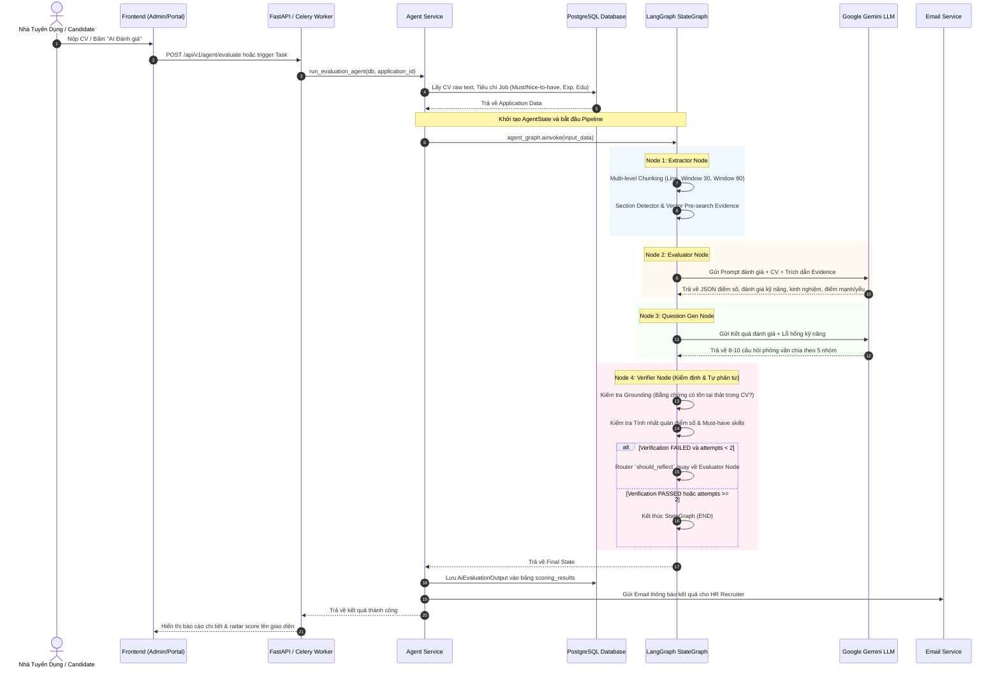
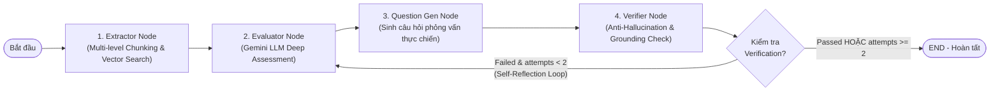
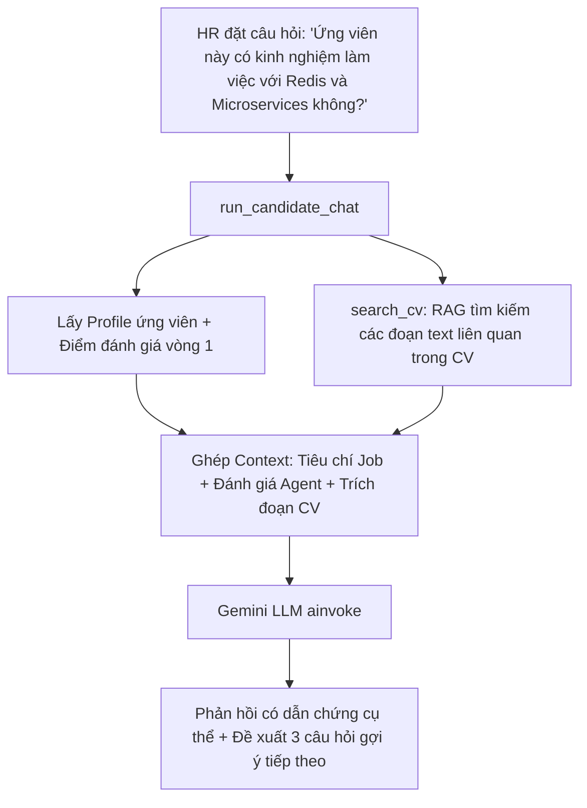

# TÀI LIỆU CHI TIẾT VỀ LUỒNG HOẠT ĐỘNG VÀ KIẾN TRÚC AI AGENT (iRSA - P-164)

> **Dự án**: iRSA (Intelligent Recruitment Screening & Assessment)  
> **Mã dự án**: P-164  
> **Công nghệ lõi**: LangGraph, Gemini LLM, FastAPI, SQLAlchemy, Multi-level Vector RAG  
> **Vị trí mã nguồn**: Thư mục `src/agents/`, `src/chunking/`, `src/services/`

---

## 1. TỔNG QUAN HỆ THỐNG AI AGENT

AI Agent trong dự án **P-164** đóng vai trò là một chuyên gia tuyển dụng & thẩm định kỹ thuật cấp cao (Senior Technical Assessor), có nhiệm vụ tự động hóa toàn bộ quy trình:
1. **Phân tích bóc tách hồ sơ CV** ứng viên thành các đoạn văn bản có cấu trúc và tọa độ chính xác.
2. **Tìm kiếm bằng chứng xác thực (Evidence-based RAG)** cho từng kỹ năng bắt buộc và ưu tiên.
3. **Đánh giá năng lực chuyên sâu & chấm điểm** theo thang chuẩn hóa bằng LLM (Gemini).
4. **Tạo bộ câu hỏi phỏng vấn thực chiến cá nhân hóa** dựa trên điểm mạnh và lỗ hổng kỹ năng thực tế.
5. **Tự phản tư và kiểm định chống ảo giác (Anti-Hallucination & Self-Reflection)** trước khi xuất kết quả.
6. **Lưu trữ dữ liệu và thông báo tự động** cho Nhà tuyển dụng qua Email.
7. **Hỗ trợ tương tác hội thoại trực tiếp** (AI Recruiter Copilot) để HR tra cứu chuyên sâu về ứng viên.

---

## 2. SƠ ĐỒ KIẾN TRÚC VÀ LUỒNG DỮ LIỆU TỔNG THỂ

### 2.1. Sequence Diagram toàn bộ vòng đời Agent



---

## 3. CẤU TRÚC TRẠNG THÁI CHIA SẺ (`AgentState`)

Mọi thông tin trong suốt quá trình chạy graph được lưu trữ tập trung trong `AgentState` (`src/agents/state.py`):

```python
class AgentState(TypedDict, total=False):
    # --- 1. Input Data từ Database ---
    application_id: int
    resume_text: str
    job_title: str
    must_have_skills: List[str]
    nice_to_have_skills: List[str]
    min_experience_years: int
    max_experience_years: Optional[int]
    min_education: Optional[str]
    recruiter_email: Optional[str]
    recruiter_name: Optional[str]
    candidate_name: str

    # --- 2. Kết quả trích xuất từ Extractor Node ---
    chunks: List[Dict[str, Any]]                          # Danh sách các chunk text
    vector_search_results: Dict[str, List[Dict[str, Any]]] # Evidence tương ứng từng skill

    # --- 3. Kết quả đánh giá từ Evaluator Node ---
    overall_score: float                                   # Thang điểm 0 - 100
    overall_assessment: str                                # Nhận xét tổng quan (tiếng Việt)
    recommendation: str                                    # STRONG_FIT / GOOD_FIT / PARTIAL_FIT / WEAK_FIT / NOT_FIT
    skill_assessments: List[Dict[str, Any]]                # Chi tiết từng skill + evidence + level
    experience_assessment: Dict[str, Any]                  # Phân tích số năm kinh nghiệm
    education_assessment: Dict[str, Any]                   # Phân tích trình độ học vấn
    strengths: List[str]                                   # Danh sách điểm mạnh có dẫn chứng
    concerns: List[str]                                    # Các điểm thiếu hụt hoặc rủi ro

    # --- 4. Kết quả từ Question Gen Node ---
    interview_questions: List[Dict[str, Any]]              # Bộ 8-10 câu hỏi phỏng vấn

    # --- 5. Kết quả kiểm định từ Verifier Node ---
    verification_passed: bool                              # True/False
    verification_feedback: str                             # Nhận xét kiểm định chất lượng
    reflection_attempts: int                               # Số lần đã lặp phản tư (tối đa 2)

    # --- 6. Trạng thái thực thi cuối ---
    email_sent: bool
    saved_to_db: bool
    error: Optional[str]
```

---

## 4. CHI TIẾT TỪNG NODE TRONG LANGGRAPH PIPELINE



---

### 4.1. Node 1: Extractor Node (`src/agents/nodes/extractor_node.py`)

* **Nhiệm vụ**: Phân tích cú pháp văn bản thô của CV, chia nhỏ thành các đơn vị phân tích độc lập và tìm kiếm ngữ nghĩa sơ bộ.
* **Quy trình hoạt động**:
  1. **Multi-level Chunking (`TextChunker.chunk_resume`)**:
     - **Line-level**: Từng dòng văn bản với chỉ số ký tự chính xác (`char_start`, `char_end`), xác định thuộc phần mục nào của CV (Kinh nghiệm, Học vấn, Kỹ năng...) qua `SectionDetector`.
     - **Window-30**: Cửa sổ trượt 30 từ (overlap 15 từ) để nắm bắt các cụm mô tả kỹ năng ngắn.
     - **Window-80**: Cửa sổ trượt 80 từ (overlap 40 từ) để nắm bắt ngữ cảnh dự án và trách nhiệm công việc đầy đủ.
     - **Tạo Block ID bảo mật**: Sử dụng SHA-256 sinh ID duy nhất định dạng `blk_{doc_hash}_{chunk_level}_{char_start}_{char_end}_{sig}` (không chứa PII của ứng viên).
  2. **Vector Similarity Pre-search (`search_cv_evidence`)**:
     - Duyệt qua toàn bộ danh sách `must_have_skills` và `nice_to_have_skills`.
     - Tìm kiếm top 3 đoạn văn bản có độ tương đồng ngữ nghĩa cao nhất trong CV gán vào `vector_search_results`.

---

### 4.2. Node 2: Evaluator Node (`src/agents/nodes/evaluator_node.py`)

* **Nhiệm vụ**: Đánh giá toàn diện sự phù hợp của ứng viên với tiêu chí tuyển dụng.
* **Cơ chế hoạt động**:
  1. **Kiểm tra đầu vào (Guard Clause)**: Nếu CV rỗng hoặc dưới 30 ký tự (file ảnh scan không OCR), trả về ngay kết quả `NOT_FIT (0 điểm)` kèm cảnh báo.
  2. **Tập hợp bằng chứng (Evidence Summary)**: Tổng hợp các chunk có độ khớp cosine $\ge 0.7$ để cung cấp trực tiếp vào ngữ cảnh của LLM.
  3. **Truy vấn Gemini LLM** với System Prompt nghiêm ngặt (`EVALUATION_SYSTEM_PROMPT`):
     - **Nguyên tắc chống ảo giác**: Bắt buộc trích dẫn nguyên văn (verbatim snippet) câu văn trong CV chứa kỹ năng đó. Tuyệt đối không suy diễn kỹ năng nếu không có văn bản chứng minh.
     - **Trọng số chấm điểm chuẩn hóa**:
       $$\text{Total Score} = 0.50 \times \text{MustHave} + 0.20 \times \text{NiceToHave} + 0.20 \times \text{Experience} + 0.10 \times \text{Education}$$
     - **Mức phân loại chuẩn (Recommendation)**:
       - $\ge 85$: `STRONG_FIT`
       - $70 - 84$: `GOOD_FIT`
       - $50 - 69$: `PARTIAL_FIT`
       - $30 - 49$: `WEAK_FIT`
       - $< 30$: `NOT_FIT`
  4. **Deterministic Fallback**: Nếu LLM timeout, gặp lỗi quota hoặc JSON output không hợp lệ, hệ thống tự động chuyển sang thuật toán Regex & Heuristic rule-based đánh giá để đảm bảo không bị gián đoạn hệ thống.

---

### 4.3. Node 3: Question Gen Node (`src/agents/nodes/question_gen_node.py`)

* **Nhiệm vụ**: Sinh danh sách câu hỏi phỏng vấn thực tế phục vụ trực tiếp cho Hội đồng tuyển dụng.
* **Nguyên tắc sinh câu hỏi**:
  - Không sinh câu hỏi chung chung lý thuyết suông; câu hỏi phải bám sát vào:
    1. **Điểm mạnh đã khai báo trong CV**: Để kiểm chứng chiều sâu chuyên môn và năng lực thực tế.
    2. **Khoảng trống kỹ năng (Skill Gaps)**: Nhắm vào các kỹ năng công việc yêu cầu nhưng CV thể hiện mờ nhạt.
    3. **Dự án nổi bật**: Yêu cầu giải thích kiến trúc, giải pháp xử lý tải, sự cố Production.
* **Phân bổ danh mục câu hỏi**:
  - `technical`: Kỹ thuật chuyên sâu, Framework, API, Database.
  - `architecture`: Thiết kế hệ thống, mở rộng quy mô, bảo mật, tối ưu hiệu năng.
  - `experience`: Kiểm chứng vai trò thực tế và quy mô dự án đã làm trong quá khứ.
  - `situational`: Tình huống xử lý sự cố thực tế trên Production, xử lý khủng hoảng.
  - `behavioral`: Kỹ năng mềm, giao tiếp, phản biện kỹ thuật, làm việc nhóm.
* **Bộ câu hỏi dự phòng (Fallback)**: Đã được định nghĩa sẵn 7 câu hỏi chuẩn mực theo phương pháp STAR nếu LLM không phản hồi.

---

### 4.4. Node 4: Verifier Node & Self-Reflection (`src/agents/nodes/verifier_node.py`)

* **Nhiệm vụ**: Đóng vai trò là Thanh tra chất lượng (Quality Assurance), rà soát lại toàn bộ kết quả của Node 2 và Node 3 trước khi xuất ra.
* **Thuật toán kiểm định**:
  1. **Hallucination Detection (`_is_evidence_grounded`)**:
     - Kiểm tra chuỗi bằng chứng `evidence` mà LLM đưa ra có thực sự là chuỗi con (substring) hoặc có độ trùng khớp từ vựng $\ge 60\%$ trong CV hay không.
     - Nếu phát hiện LLM tự "bịa" ra bằng chứng không có trong CV $\rightarrow$ Tự động đổi cờ `found: True` thành `found: False` và ghi nhận `hallucination_found = True`.
  2. **Score-Skill Consistency Enforcement**:
     - Nếu ứng viên **không đạt bất kỳ kỹ năng bắt buộc (Must-Have) nào** ($0/N$), điểm số không được phép vượt quá $20.0$ điểm (ép về mức `NOT_FIT`).
     - Nếu ứng viên đạt $< 50\%$ kỹ năng bắt buộc, điểm số không được phép vượt quá $45.0$ điểm (ép về mức `WEAK_FIT`).
  3. **Self-Reflection Router (`should_reflect`)**:
     ```python
     def should_reflect(state: AgentState) -> str:
         passed = state.get("verification_passed", False)
         attempts = state.get("reflection_attempts", 0)
         if not passed and attempts < 2:
             return "evaluator"  # Quay lại Evaluator để tái thẩm định
         return END
     ```

---

## 5. HẬU XỬ LÝ & TÍCH HỢP HỆ THỐNG (POST-EXECUTION)

Khi StateGraph chạm tới trạng thái `END`, `agent_service.py` thực hiện chuỗi tác vụ sau:

1. **Chuẩn hóa Schema Pydantic**: Đảm bảo cấu trúc dữ liệu tuân thủ chuẩn `AiEvaluationOutput`.
2. **Lưu trữ vào Cơ sở dữ liệu (`save_agent_evaluation`)**:
   - Cập nhật điểm số `ai_score` và toàn bộ JSON đánh giá vào bảng `scoring_results`.
   - Cập nhật trạng thái của `applications` sang giai đoạn tiếp theo (Screened/Evaluated).
3. **Gửi thông báo Email tự động (`send_hr_notification_async`)**:
   - Gửi báo cáo tóm tắt độ phù hợp, điểm mạnh, điểm yếu và liên kết chi tiết trực tiếp đến hòm thư của HR Recruiter quản lý tin tuyển dụng đó.

---

## 6. TÍNH NĂNG BỔ TRỢ: AI RECRUITER COPILOT (CHAT AGENT)

Ngoài quy trình đánh giá tự động một chiều, hệ thống tích hợp tính năng Trợ lý AI tương tác trực tiếp qua hàm [`run_candidate_chat`](file:///C:/Users/Nguye/Desktop/aithucchien/project/P-164/src/services/agent_service.py#L88-L164):



* **Đặc điểm nổi bật của Chat Agent**:
  - Nắm rõ toàn bộ bối cảnh điểm sàng lọc Vòng 1 và đánh giá chuyên sâu của AI Agent.
  - Tự động tìm kiếm các trích đoạn văn bản trong CV để trả lời chính xác có dẫn chứng.
  - Tự động gợi ý 3 câu hỏi gợi ý tiếp theo (`suggested_followups`) giúp HR khai thác sâu hơn hồ sơ ứng viên.

---

## 7. BẢNG TỔNG HỢP CÁC FILE NGUỒN QUAN TRỌNG

| Thành phần | Đường dẫn file | Chức năng chính |
| :--- | :--- | :--- |
| **StateGraph Builder** | [`src/agents/graph.py`](file:///C:/Users/Nguye/Desktop/aithucchien/project/P-164/src/agents/graph.py) | Xây dựng đồ thị StateGraph, định nghĩa các node và router phản tư |
| **State Schema** | [`src/agents/state.py`](file:///C:/Users/Nguye/Desktop/aithucchien/project/P-164/src/agents/state.py) | Định nghĩa TypedDict `AgentState` lưu trữ trạng thái toàn chu trình |
| **Extractor Node** | [`src/agents/nodes/extractor_node.py`](file:///C:/Users/Nguye/Desktop/aithucchien/project/P-164/src/agents/nodes/extractor_node.py) | Băm text 3 cấp độ, phân tích section và vector pre-search |
| **Evaluator Node** | [`src/agents/nodes/evaluator_node.py`](file:///C:/Users/Nguye/Desktop/aithucchien/project/P-164/src/agents/nodes/evaluator_node.py) | Đánh giá năng lực chuyên sâu, chấm điểm và cơ chế deterministic fallback |
| **Question Gen Node** | [`src/agents/nodes/question_gen_node.py`](file:///C:/Users/Nguye/Desktop/aithucchien/project/P-164/src/agents/nodes/question_gen_node.py) | Sinh 8-10 câu hỏi phỏng vấn thực chiến cá nhân hóa |
| **Verifier Node** | [`src/agents/nodes/verifier_node.py`](file:///C:/Users/Nguye/Desktop/aithucchien/project/P-164/src/agents/nodes/verifier_node.py) | Kiểm định bằng chứng chống ảo giác, kiểm soát tính nhất quán điểm số |
| **Chunking Engine** | [`src/chunking/text_chunker.py`](file:///C:/Users/Nguye/Desktop/aithucchien/project/P-164/src/chunking/text_chunker.py) | Thuật toán băm CV đa cấp độ, sinh Block ID SHA-256 an toàn |
| **Service Layer** | [`src/services/agent_service.py`](file:///C:/Users/Nguye/Desktop/aithucchien/project/P-164/src/services/agent_service.py) | Wrapper thực thi Pipeline, lưu DB, gửi Mail và Chat Copilot |
| **API Endpoints** | [`src/api/routes.py`](file:///C:/Users/Nguye/Desktop/aithucchien/project/P-164/src/api/routes.py) | Các endpoint `/evaluate` và `/status` của Agent |
